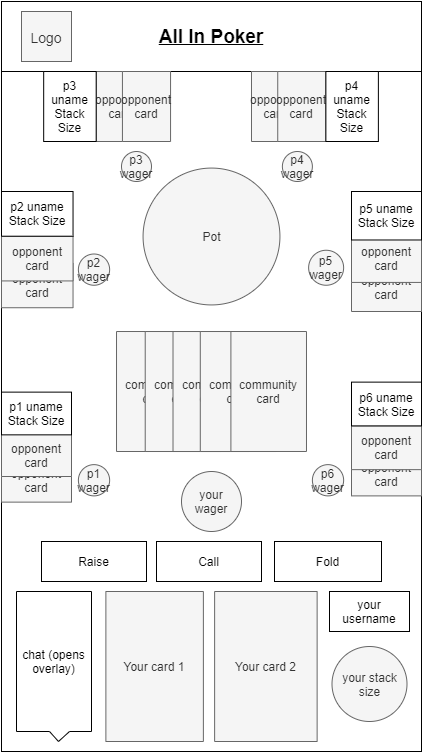

# User Experience Design
Team *beizhang-discrete* (All In Poker)

## App Map & Wireframes

### App Map

---

### Wireframes
#### Home Page
Default start-up page in browser. Contains a header with a logo and the title of our app (which will persist across pages). Clicking on either the logo or title will return the user to this home page. On it, there are two major options, *Create a Table* and *Play Now (Join Table)*, whose buttons will likely be styled as playing cards. The *Login/Sign Up* button at the bottom will lead to a login page (logging in is optional) and will change to a *Logout* button when the user is logged in. The *User Profile* button at the top will lead to a page with user info, or to the login page if the user is not logged in.

#### Login/Signup Page
The user may fill in their information to log into an existing account or create a new one. We will also potentially have an option at the bottom to sign in with Google. Users logged in will see a modified home page and gain access to their user profile.

#### User Profile Page
Contains basic user information (such as username, profile picture, date joined, games played/won) and a list of friends, with incoming friend requests at the top. There is also a user search function at the bottom. 

#### Join Table Page
This page contains a list of information about live tables (which can be Open, Full, or Playing; private tables will not be shown), sorted by Open first. Players can choose *Quick Play* at the top to join a random open table, or choose *Join Private Table* at the bottom to join a friend-invite-only table. Choosing any option (assuming there is room at the table) will take the user to that table's page.

#### Create Table Page
This page contains user-adjustable parameters for creating a new table. Optionally, users can *Invite Friends*, which will pop up an overlay with a list of their friends to invite. Filling in valid fields and pressing *Create* will take the user to a page representing the table.

#### Game Table Page
This page contains the interface for playing the actual game, and the labels are self-explanatory. The player can see their own cards, stack size, the pot/community cards, and possible actions during the round. Choosing actions during your turn will cause the board to update. The bottom left *chat* button will open an overlay with recent chat history between the players.

